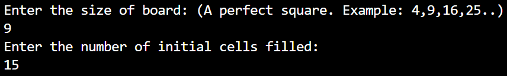
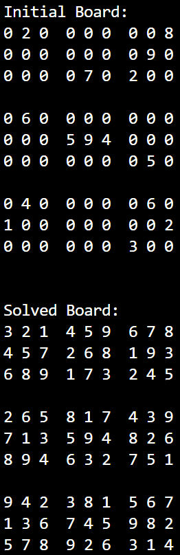
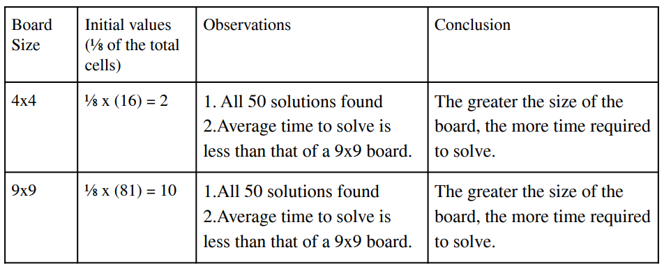
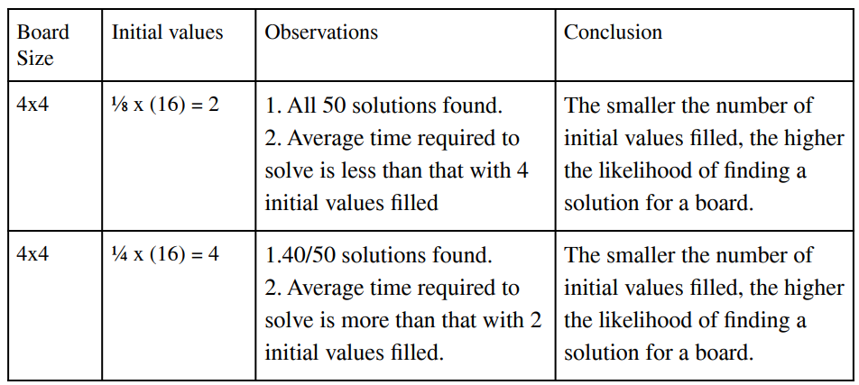
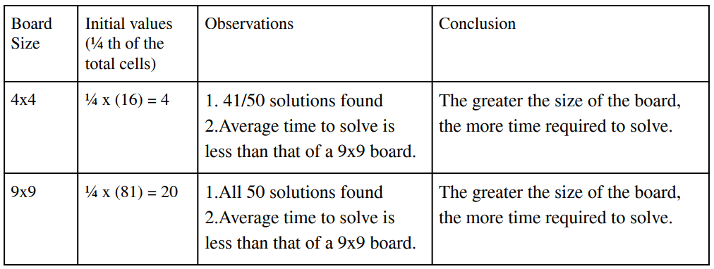

# SUDOKU SOLVER

Java-based graphical Sudoku Solver for solving and visualizing Sudoku puzzles.

## 🚀 Running Sudoku:
To run Sudoku on the file Sudoku 

```sh
javac Sudoku.java
java Sudoku
```

## 👀 Example Running Sudoku:






## 📈 Analysis:

#### 1. Comparing different board sizes with the same fraction of initial values:


Table1.1: Comparing simulating of ⅛ th of total cells for 4x4 and 9x9 boards

####


Table1.2: Comparing simulating of ¼ th of total cells for 4x4 and 9x9 boards

#### 2. Comparing same board sizes with the different fraction of initial values:


Table2.1: Comparing simulating of ⅛ th of total cells for a 4x4 board.


## ⚖️ License:
MIT License
